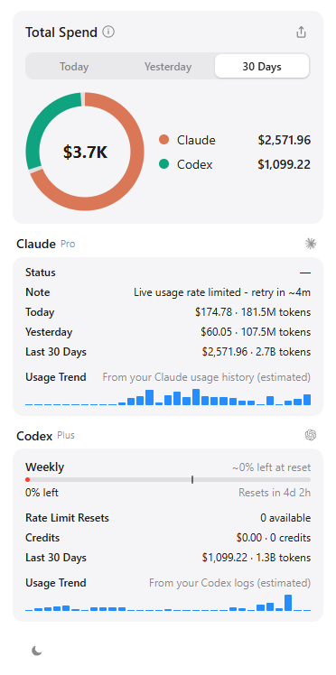
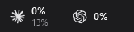
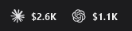

# OpenUsage for Windows

**All your AI coding subscription limits and spend — on the Windows taskbar.**

A Windows port of [OpenUsage](https://github.com/robinebers/openusage) (the native‑Swift macOS menu‑bar
app). The macOS app can't run on Windows — it's built on SwiftUI/AppKit — so this port keeps the exact
provider engine and recreates the experience with a **taskbar strip + popover** that look and behave
like the Mac original.

<p align="center">
  
</p>

The metrics live right on your taskbar and rotate between **usage** and **API‑price spend**:

<p align="center">
  
  &nbsp;&nbsp;⟳&nbsp;&nbsp;
  
</p>

---

## Download

**[⬇ Download the latest release](../../releases/latest)** → unzip anywhere → run **`OpenUsageTray.exe`**.

No installer, no .NET, no Swift — everything is bundled. A slim strip appears at the right end of your
taskbar showing your usage; **click it** for the full dashboard, **right-click** for Refresh / Dark mode /
Quit, and **drag** it to reposition.

<sub>Windows 10/11 x64. Needs the WebView2 runtime, which ships with Windows 11 and current Windows 10.
Your provider credentials are read locally — OpenUsage never sends them anywhere.</sub>

## What you get

- **Taskbar strip (the macOS menu‑bar pins).** A slim, transparent, always‑on‑top overlay drawn onto the
  taskbar — no system‑tray icon. Each provider shows its glyph and **rotates between "% left" and its
  30‑day API‑price spend** with a smooth vertical‑roll animation. Left‑click expands the popover, drag to
  reposition, right‑click for the menu.
- **1:1 popover.** The full Mac dashboard, rebuilt in HTML/CSS from the original SwiftUI design tokens: a
  **Total Spend donut** with a sliding, draggable Today / Yesterday / 30 Days segmented control, per‑provider
  **meter cards** (session / weekly / …) with pace ticks and reset countdowns, spend rows, and usage‑trend
  sparklines. Opens with a macOS‑style corner spring.
- **Light & dark mode.** Toggle from the popover footer or the strip's right‑click menu; matches the macOS
  dark palette.
- **True API‑price spend.** Your local usage logs are priced at published API rates (per model, per token
  type, including cache tiers), so you see what your subscription usage *would* have cost via the API.
- **Same providers as upstream.** Reads the credentials already on your machine. Verified on Windows for
  **Claude** and **Codex**; others (Cursor, Copilot, Devin, Grok, OpenCode, OpenRouter, Z.ai) work when
  signed in. Providers that fail auth show an inline "sign in again" note instead of silently vanishing.

## How it's built

Two pieces:

1. **`openusage` CLI** — the upstream Swift core, ported to build with the [Swift for Windows](https://www.swift.org/install/windows/)
   toolchain. `Package.swift` branches on `#if os(Windows)`: it drops the GUI targets and Apple‑only
   dependencies (Sparkle, KeyboardShortcuts, PostHog), swaps CryptoKit for
   [swift‑crypto](https://github.com/apple/swift-crypto), and guards every macOS‑only API (`os.Logger`,
   Keychain, `Network.framework`, POSIX file syscalls, `URLSession` → `FoundationNetworking`, …). It emits
   the usage payload as JSON.
2. **`OpenUsageTray`** — a small .NET 9 WinForms host (in [`tray/`](tray/)) that draws the taskbar strip
   with GDI+ and renders the popover in an embedded WebView2, fed by the CLI.

See [WINDOWS.md](WINDOWS.md) for the full port notes and limitations.

## Build from source

**Requirements:** [Swift for Windows](https://www.swift.org/install/windows/) (6.3+) and the
[.NET 9 SDK](https://dotnet.microsoft.com/download).

```sh
# 1. Build the usage-reader CLI (Swift)
swift build -c release --product openusage-cli

# 2. Build the taskbar app (.NET)
cd tray
dotnet build -c Release
# copy the CLI next to the tray exe so it's found:
cp ../.build/release/openusage-cli.exe bin/Release/net9.0-windows/openusage.exe
```

Run `bin/Release/net9.0-windows/OpenUsageTray.exe`. It puts a strip on your taskbar; click it for the
popover. Right‑click → Quit.

To produce the self‑contained release bundle yourself, run [`tray/build-dist.sh`](tray/build-dist.sh) —
it publishes a single‑file `OpenUsageTray.exe` into `dist/` alongside the CLI, the Swift runtime, and
`web/`.

## Known limitations vs. macOS

- No native taskbar embedding exists on Windows, so the strip is a topmost overlay (the technique
  TrafficMonitor/XMeters use). On auto‑hiding taskbars or multi‑monitor setups it may need a one‑time drag.
- No Sparkle auto‑update, global shortcut, or local HTTP server (all Apple‑framework features).
- Fonts render in Segoe UI rather than SF Pro.
- Providers that store credentials only in the macOS Keychain (Antigravity, the Claude Desktop source) are
  unavailable on Windows.

## Credits

- Original app: **[robinebers/openusage](https://github.com/robinebers/openusage)** — all provider logic,
  pricing, and design are theirs.
- Windows port: **[CheesyPoofs346](https://github.com/CheesyPoofs346)** with **[Claude](https://claude.com/claude-code)**.

Licensed under the same terms as upstream — see [LICENSE](LICENSE) and [TRADEMARK.md](TRADEMARK.md).
